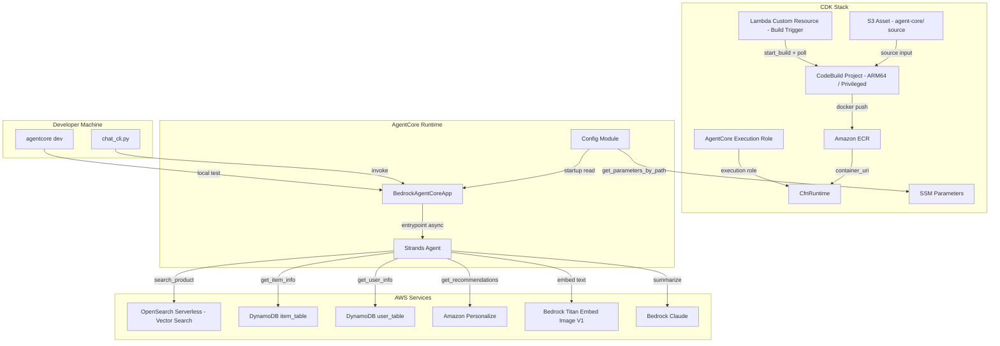
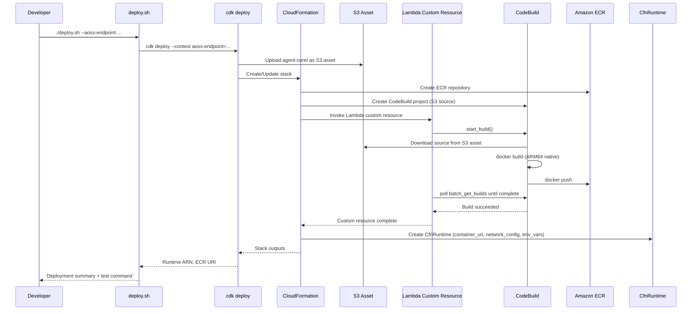

# Design Document: AgentCore Sales Agent

## Overview

This design describes the re-implementation of the existing Bedrock Agent-based sales assistant as a Bedrock AgentCore Runtime application using the Strands Agents SDK. The current system uses a Lambda handler (`lambda/handler.py`) behind a Bedrock Agent with an OpenAPI action group to provide three capabilities: product search via OpenSearch Serverless vector search, product comparison with user profile enrichment, and personalized recommendations via Amazon Personalize.

The new implementation lives in `agent-core/` and replaces the Lambda + Bedrock Agent architecture with:
- A **Strands Agents SDK** agent wrapped in `BedrockAgentCoreApp` for AgentCore Runtime hosting
- Three Strands `@tool`-decorated functions porting the existing Lambda logic
- A **config module** reading from AWS Systems Manager Parameter Store at startup with environment variable fallback
- A **CDK stack** provisioning ECR, CodeBuild (S3 asset source), Lambda custom resource build trigger, `CfnRuntime`, SSM parameters, and an AgentCore execution IAM role
- An **ARM64 Docker image** built natively via CodeBuild and pushed to ECR
- A **deploy.sh** script wrapping `cdk deploy` (no separate `agentcore configure/launch` needed)
- A **chat_cli.py** for interactive developer testing

### Design Rationale

1. **Direct tool invocation** — Strands `@tool` functions replace the OpenAPI action group indirection
2. **Simpler agent config** — Python code replaces CDK + OpenAPI schema for agent behavior
3. **Container-based deployment** — ARM64 Docker image with VPC support for AOSS access
4. **Centralized config** — Parameter Store (CDK-provisioned) replaces Lambda environment variables
5. **Atomic CDK deployment** — `CfnRuntime` + CodeBuild trigger via Lambda custom resource means `cdk deploy` handles everything; no separate `agentcore configure/launch` commands needed
6. **Infrastructure-as-code** — CDK provisions ECR, CodeBuild, CfnRuntime, and SSM parameters, consistent with the existing CDK project

## Architecture



### Deployment Flow



## Components and Interfaces

### Project Structure

```
agent-core/
├── agent.py                  # BedrockAgentCoreApp entrypoint + Strands Agent
├── config.py                 # Parameter Store / env var config loader
├── requirements.txt          # Pinned deps (generated via uv pip compile)
├── tools/
│   ├── __init__.py           # Exports: search_product, compare_product, get_recommendation
│   ├── search_product.py     # @tool: vector search via AOSS
│   ├── compare_product.py    # @tool: comparison with user enrichment + LLM summary
│   ├── get_recommendation.py # @tool: Personalize recommendations + LLM summary
│   └── helpers.py            # Shared: get_user_info, get_item_info, get_embedding, call_bedrock_llm, create_opensearch_client
├── cdk/
│   ├── __init__.py
│   ├── app.py                # CDK app entry: AgentCoreStack instantiation
│   ├── agentcore_stack.py    # CDK stack: ECR, CodeBuild, LCR, CfnRuntime, SSM params
│   └── infra_utils/
│       ├── __init__.py
│       ├── agentcore_role.py       # IAM role for bedrock-agentcore.amazonaws.com
│       └── build_trigger_lambda.py # Lambda handler for CodeBuild trigger custom resource
├── tests/
│   ├── test_config.py
│   ├── test_entrypoint.py
│   ├── test_search_product.py
│   ├── test_compare_product.py
│   ├── test_recommendation.py
│   ├── test_error_handling.py
│   └── test_chat_cli.py
├── Dockerfile
├── deploy.sh
├── chat_cli.py
├── pyproject.toml
├── .env.example
└── README.md
```


### Component Details

#### 1. `config.py` — Configuration Module

Reads configuration from Parameter Store at startup, falling back to environment variables.

```python
class Config:
    aoss_collection_id: str
    aoss_region: str
    item_table_name: str      # default: "item_table"
    user_table_name: str      # default: "user_table"
    recommender_arn: str | None
    model_id: str             # default: "anthropic.claude-sonnet-4-20250514"
    parameter_store_prefix: str  # default: "/agentcore/sales-agent/"

    @classmethod
    def load(cls) -> "Config":
        """
        1. Read PARAMETER_STORE_PREFIX env var (default: /agentcore/sales-agent/)
        2. Call ssm.get_parameters_by_path(Path=prefix) to fetch all params in one API call
        3. Map parameter names to config fields (e.g., {prefix}aoss_collection_id -> aoss_collection_id)
        4. For any missing parameter, fall back to the corresponding environment variable
        5. Apply defaults for item_table_name, user_table_name, model_id
        6. If Parameter Store is unreachable, log warning and fall back entirely to env vars
        7. Raise ValueError if required fields (aoss_collection_id, aoss_region) are missing from both sources
        """
```

#### 2. `agent.py` — Entrypoint Module

```python
from bedrock_agentcore.runtime import BedrockAgentCoreApp
from strands import Agent
from tools import search_product, compare_product, get_recommendation
from config import Config

app = BedrockAgentCoreApp()
config = Config.load()

SYSTEM_PROMPT = """You are a professional sales expert which can help customer on:
1. Search products based on customer conditions and requirements.
2. Compare products using user history, preferences, and demographics.
3. Generate personalized product recommendations based on user profile.
4. Respond to the customer in the same language they use."""

agent = Agent(
    system_prompt=SYSTEM_PROMPT,
    tools=[search_product, compare_product, get_recommendation],
    model="bedrock/" + config.model_id,
)

@app.entrypoint
async def invoke(payload=None):
    prompt = (payload.get("prompt", "Hello! How can I help you today?")
              if payload else "Hello! How can I help you today?")
    result = agent(prompt)
    return {"result": str(result)}

if __name__ == "__main__":
    app.run()
```

Key points:
- `@app.entrypoint` decorates an **async** function with only an optional `payload` parameter (no context parameter)
- `app.run()` in `__main__` block starts the AgentCore Runtime HTTP server
- Config is loaded once at module level (singleton pattern)

#### 3. `tools/search_product.py` — Product Search Tool

```python
from strands import tool

@tool
def search_product(condition: str) -> str:
    """Search for products based on a text condition describing customer requirements.

    Args:
        condition: Text description of what the customer is looking for.

    Returns:
        JSON string with up to 5 matching products (item_id, score, image, price, style, description).
    """
```

Implementation (ported from `lambda/handler.py`):
1. Call `get_embedding_for_text(condition)` → Bedrock Titan Embed Image V1 (`amazon.titan-embed-image-v1`)
2. Build AOSS host from `config.aoss_collection_id` + `config.aoss_region` + `.aoss.amazonaws.com`
3. Create `OpenSearch` client with `AWSV4SignerAuth` (service=`aoss`)
4. Execute KNN query on `product-search-multimodal-index` with `k=5`, `_source` fields: `item_id`, `price`, `style`, `image_product_description`, `image_path`
5. Map hits to product dicts: `item_id`, `score`, `image`, `price`, `style`, `description`
6. Return JSON string of product list
7. Wrap in try/except — return descriptive error string on failure

#### 4. `tools/compare_product.py` — Product Comparison Tool

```python
@tool
def compare_product(user_id: str, condition: str, preference: str) -> str:
    """Compare products for a user based on search condition and preferences.

    Args:
        user_id: The unique user identifier.
        condition: Text description of products to search for.
        preference: User's preferences for comparison.

    Returns:
        JSON with 'items' list and 'summarize' comparison text.
    """
```

Implementation (ported from `lambda/handler.py`):
1. Call internal search logic (same as `search_product`) to get matching items
2. Call `get_user_info(user_id)` → DynamoDB `user_table` query for age, gender, history
3. For each item ID in visited/add_to_cart/purchased lists, call `get_item_info(item_id)` → DynamoDB `item_table`
4. Construct comparison prompt with user demographics, history, preferences, and available items
5. Call `call_bedrock_llm(prompt)` → Bedrock Claude for comparison summary
6. Return JSON: `{"items": [...], "summarize": "..."}`
7. Wrap in try/except — return descriptive error string on failure

#### 5. `tools/get_recommendation.py` — Recommendation Tool

```python
@tool
def get_recommendation(user_id: str, preference: str) -> str:
    """Get personalized product recommendations for a user.

    Args:
        user_id: The unique user identifier.
        preference: User's preferences to guide recommendations.

    Returns:
        JSON with 'items' list and 'summarize' recommendation text.
    """
```

Implementation (ported from `lambda/handler.py`):
1. Read `config.recommender_arn` — if None, return `"Recommender is not configured. Set RECOMMENDER_ARN."`
2. Call `personalize_runtime.get_recommendations(recommenderArn=..., userId=..., numResults=5)`
3. Call `get_user_info(user_id)` → DynamoDB `user_table`
4. Enrich with item history from `item_table`
5. Construct recommendation prompt and call `call_bedrock_llm(prompt)`
6. Return JSON: `{"items": [...], "summarize": "..."}`
7. Wrap in try/except — return descriptive error string on failure

#### 6. `tools/helpers.py` — Shared Utilities

```python
def get_user_info(user_id: int, config: Config) -> dict:
    """Fetch user profile (age, gender, visited/add_to_cart/purchased lists) from DynamoDB user_table.
    Raises descriptive error if user not found."""

def get_item_info(item_id: str, config: Config) -> dict:
    """Fetch item details (item_id, title, price, style, image) from DynamoDB item_table.
    Raises descriptive error if item not found."""

def get_embedding_for_text(text: str) -> list[float]:
    """Generate vector embedding via Bedrock Titan Embed Image V1 (amazon.titan-embed-image-v1).
    Returns the embedding vector from the response."""

def call_bedrock_llm(prompt: str, config: Config) -> str:
    """Invoke Bedrock Claude (config.model_id) with the given prompt.
    Returns the text content from the response."""

def create_opensearch_client(config: Config) -> OpenSearch:
    """Create OpenSearch client authenticated with AWSV4SignerAuth for AOSS."""
```


#### 7. `cdk/agentcore_stack.py` — CDK Infrastructure Stack

The stack provisions the full AgentCore Runtime atomically via CDK. Based on the official AgentCore CDK sample pattern.

```python
from aws_cdk import (
    Stack, RemovalPolicy, Duration, CfnOutput,
    aws_ecr as ecr,
    aws_codebuild as codebuild,
    aws_ssm as ssm,
    aws_iam as iam,
    aws_s3_assets as s3_assets,
    aws_lambda as lambda_,
    aws_bedrockagentcore as bedrockagentcore,
    CustomResource,
)
from constructs import Construct
```

**Requires:** `aws-cdk-lib>=2.220.0` for the `aws_bedrockagentcore` module.

Resources provisioned:

1. **ECR Repository** — Stores ARM64 Docker images. `empty_on_delete=True`, `image_scan_on_push=True`, `RemovalPolicy.DESTROY`.

2. **S3 Asset** — CDK packages the `agent-core/` directory as an S3 asset for CodeBuild source input (NOT Git source).

3. **CodeBuild Project** — ARM64 native build:
   - Image: `LinuxArmBuildImage.AMAZON_LINUX_2_STANDARD_3_0`
   - Compute: `ComputeType.LARGE`
   - Privileged mode: `True` (required for Docker builds)
   - Source: `codebuild.Source.s3(bucket=asset.bucket, path=asset.s3_object_key)`
   - Buildspec: **Inline** via `BuildSpec.from_object()` — NO separate `buildspec.yml` file
   - Buildspec phases:
     - `pre_build`: `aws ecr get-login-password | docker login`
     - `build`: `docker build -t $REPO_URI:latest .`
     - `post_build`: `docker push $REPO_URI:latest`

4. **Lambda Custom Resource** — Triggers CodeBuild during stack deployment:
   - Starts a CodeBuild build via `start_build()`
   - Polls `batch_get_builds()` until build completes or fails
   - Reports success/failure back to CloudFormation
   - CfnRuntime depends on this resource (build must complete first)

5. **AgentCore Execution Role** — IAM role assumed by `bedrock-agentcore.amazonaws.com`:
   - ECR pull: `ecr:BatchGetImage`, `ecr:GetDownloadUrlForLayer`, `ecr:GetAuthorizationToken`
   - CloudWatch logs: `/aws/bedrock-agentcore/runtimes/*`
   - X-Ray traces
   - Bedrock: `bedrock:InvokeModel`, `bedrock:InvokeModelWithResponseStream`
   - SSM: `ssm:GetParametersByPath` for `/agentcore/sales-agent/*`
   - DynamoDB: `dynamodb:Query`, `dynamodb:GetItem` on item and user tables
   - OpenSearch Serverless: `aoss:APIAccessAll`
   - Personalize: `personalize:GetRecommendations`

6. **CfnRuntime** — `bedrockagentcore.CfnRuntime`:
   - `container_uri`: ECR image URI (`{account}.dkr.ecr.{region}.amazonaws.com/{repo}:latest`)
   - `network_configuration`: PUBLIC mode (default) or VPC mode with subnets/security groups
   - `protocol_configuration`: `"HTTP"`
   - `environment_variables`: runtime config values
   - Depends on Lambda custom resource (build must complete first)

7. **SSM Parameters** — Under `/agentcore/sales-agent/` prefix:
   - `aoss_collection_id`, `aoss_region`, `item_table_name`, `user_table_name`, `recommender_arn`
   - Values sourced from CDK context parameters

8. **CfnOutputs** — `RuntimeArn`, `RuntimeId`, `EcrRepositoryUri`

**CDK Context Parameters** (passed via `--context` or `cdk.json`):

| Parameter | Required | Default | Description |
|---|---|---|---|
| `aoss-endpoint` | Yes | — | OpenSearch Serverless collection ID |
| `aoss-region` | No | Stack region | AWS region for AOSS |
| `item-table-name` | No | `item_table` | DynamoDB item table name |
| `user-table-name` | No | `user_table` | DynamoDB user table name |
| `recommender-arn` | No | — | Amazon Personalize recommender ARN |
| `network-mode` | No | `PUBLIC` | `PUBLIC` or `PRIVATE` |
| `subnets` | If PRIVATE | — | Comma-separated subnet IDs |
| `security-groups` | If PRIVATE | — | Comma-separated security group IDs |

#### 8. `cdk/infra_utils/agentcore_role.py` — AgentCore Execution Role

Dedicated module creating the IAM role assumed by `bedrock-agentcore.amazonaws.com`. Permissions listed in the stack section above. Separated for maintainability.

#### 9. `cdk/infra_utils/build_trigger_lambda.py` — CodeBuild Trigger Lambda

Lambda function handler used as a CloudFormation custom resource:
- On `Create`/`Update`: calls `codebuild.start_build(projectName=...)`, then polls `batch_get_builds()` in a loop until `buildStatus` is `SUCCEEDED` or `FAILED`
- On `Delete`: no-op
- Reports result via `cfn-response` (or custom HTTPS callback)
- Timeout: 15 minutes (to accommodate Docker build time)

#### 10. `deploy.sh` — Deployment Script

```bash
#!/bin/bash
set -euo pipefail
# Usage: ./deploy.sh \
#   --aoss-endpoint <endpoint> \
#   [--item-table <name>] \
#   [--user-table <name>] \
#   [--recommender-arn <arn>] \
#   [--network-mode PUBLIC|PRIVATE] \
#   [--subnets <comma-separated>] \
#   [--security-groups <comma-separated>] \
#   [--region <region>]
```

Steps:
1. Parse CLI arguments; validate `--aoss-endpoint` is provided
2. Build CDK context args string from CLI parameters
3. Run `cdk deploy AgentCoreStack` with context parameters — CDK atomically provisions ECR, uploads S3 asset, creates CodeBuild, triggers build via Lambda custom resource, waits for build, creates CfnRuntime, creates SSM parameters
4. Extract `RuntimeArn` and `EcrRepositoryUri` from CDK outputs
5. Print deployment summary with Runtime ARN, ECR URI, and test invoke command
6. Print a note reminding the user to call `update_agent_runtime` after subsequent image rebuilds to redeploy the latest image
7. Exit non-zero on any step failure (guaranteed by `set -euo pipefail`)

**Note on subsequent deploys:** `CfnRuntime` is created on the initial deploy with the `:latest` tag. On subsequent deploys, after CodeBuild pushes a new image to ECR, the user must call `update_agent_runtime` (via AWS CLI or SDK) to trigger AgentCore to pick up the new image. The DEFAULT endpoint automatically points to the latest version once updated. The README documents this workflow.

#### 11. `chat_cli.py` — Interactive Chat CLI

```python
# Usage: python chat_cli.py [--endpoint <url>] [--user-id <id>]
```

- Reads endpoint from `--endpoint` arg or `AGENTCORE_ENDPOINT` env var (CLI arg takes precedence)
- Displays welcome message, enters REPL loop
- Sends `{"prompt": "<message>", "user_id": "<id>"}` payload to endpoint via HTTP POST
- Displays agent response
- Exits gracefully on `exit` or `quit` with farewell message
- Handles connection errors with descriptive message and retry prompt

#### 12. `Dockerfile` — ARM64 Container Image

```dockerfile
FROM public.ecr.aws/docker/library/python:3.12-slim

WORKDIR /app
COPY requirements.txt requirements.txt
RUN pip install --no-cache-dir -r requirements.txt && \
    pip install --no-cache-dir aws-opentelemetry-distro==0.10.1

ENV AWS_DEFAULT_REGION=us-east-1

RUN useradd -m -u 1000 bedrock_agentcore
USER bedrock_agentcore

EXPOSE 8080
EXPOSE 8000

COPY . .

HEALTHCHECK --interval=30s --timeout=3s --start-period=5s --retries=3 \
  CMD curl -f http://localhost:8080/ping || exit 1

CMD ["opentelemetry-instrument", "python", "agent.py"]
```

Key patterns from official AgentCore documentation:
- Single-stage build from `python:3.12-slim` (public ECR)
- Non-root user `bedrock_agentcore` (uid 1000)
- OpenTelemetry instrumentation (`aws-opentelemetry-distro==0.10.1`)
- Healthcheck on port 8080
- Ports 8080 (HTTP) and 8000 exposed
- ARM64 target handled by CodeBuild ARM64 environment (no `--platform` flag needed)

## Data Models

### Configuration Parameters (Parameter Store)

| Parameter Path | Description | Default |
|---|---|---|
| `/agentcore/sales-agent/aoss_collection_id` | OpenSearch Serverless collection ID | (required) |
| `/agentcore/sales-agent/aoss_region` | AWS region for AOSS | (required) |
| `/agentcore/sales-agent/item_table_name` | DynamoDB item table name | `item_table` |
| `/agentcore/sales-agent/user_table_name` | DynamoDB user table name | `user_table` |
| `/agentcore/sales-agent/recommender_arn` | Amazon Personalize recommender ARN | (optional) |

### Environment Variables

| Variable | Description | Default |
|---|---|---|
| `PARAMETER_STORE_PREFIX` | SSM parameter path prefix | `/agentcore/sales-agent/` |
| `AOSS_COLLECTION_ID` | Fallback: AOSS collection ID | — |
| `AOSS_REGION` | Fallback: AOSS region | — |
| `ITEM_TABLE_NAME` | Fallback: DynamoDB item table | `item_table` |
| `USER_TABLE_NAME` | Fallback: DynamoDB user table | `user_table` |
| `RECOMMENDER_ARN` | Fallback: Personalize ARN | — |
| `MODEL_ID` | Bedrock model ID | `anthropic.claude-sonnet-4-20250514` |
| `AGENTCORE_ENDPOINT` | Chat CLI: agent endpoint | — |

### Entrypoint Payload

```json
// Request
{
  "prompt": "I'm looking for red running shoes",
  "user_id": "123"
}

// Response
{
  "result": "Based on your search, I found these products..."
}
```

### Product Search Result

```json
[
  {
    "item_id": "abc-123",
    "score": 0.95,
    "image": "images/product_abc.jpg",
    "price": "49.99",
    "style": "Athletic",
    "description": "Red running shoes with cushioned sole"
  }
]
```

### Comparison / Recommendation Result

```json
{
  "items": [...],
  "summarize": "Based on your profile and preferences, I recommend..."
}
```

### User Profile (from DynamoDB `user_table`)

```json
{
  "user_id": "123",
  "age": "28",
  "gender": "Female",
  "visted": ["item-id-1"],
  "add_to_cart": ["item-id-2"],
  "purchased": ["item-id-3"]
}
```

### Item Info (from DynamoDB `item_table`)

```json
{
  "item_id": "abc-123",
  "title": "Red Running Shoes",
  "price": "49.99",
  "style": "Athletic",
  "image": "images/product_abc.jpg"
}
```


## Correctness Properties

*A property is a characteristic or behavior that should hold true across all valid executions of a system — essentially, a formal statement about what the system should do. Properties serve as the bridge between human-readable specifications and machine-verifiable correctness guarantees.*

### Property 1: Config loads from Parameter Store

*For any* set of configuration values stored in Parameter Store under a given prefix, `Config.load()` should return a Config object where each field (`aoss_collection_id`, `aoss_region`, `item_table_name`, `user_table_name`, `recommender_arn`) matches the corresponding Parameter Store value.

**Validates: Requirements 7.1, 7.2, 7.3, 7.4, 7.5, 13.1, 13.2, 13.3, 13.4**

### Property 2: Config falls back to environment variables with defaults

*For any* config field that is not present in Parameter Store, `Config.load()` should return the value from the corresponding environment variable. If neither Parameter Store nor environment variable is set, the default value should be used (`item_table_name` → `"item_table"`, `user_table_name` → `"user_table"`, `model_id` → `"anthropic.claude-sonnet-4-20250514"`, `parameter_store_prefix` → `"/agentcore/sales-agent/"`).

**Validates: Requirements 7.4, 7.5, 7.6, 13.5, 13.6**

### Property 3: Entrypoint extracts prompt and returns result

*For any* payload dict containing a `prompt` key with a non-empty string value, the entrypoint function should pass that string to the Strands Agent and return a dict containing a `result` key with the agent's string response.

**Validates: Requirements 2.3, 2.4**

### Property 4: Search results have correct format and bounded size

*For any* set of OpenSearch KNN hits (0 to N), the Product Search Tool should return a JSON list of at most 5 items, where each item contains exactly the fields: `item_id`, `score`, `image`, `price`, `style`, and `description`.

**Validates: Requirements 4.3**

### Property 5: Compare and Recommend tools return structured output

*For any* valid inputs to the Product Compare Tool or Recommendation Tool, the returned JSON object should contain both an `items` key (list) and a `summarize` key (string).

**Validates: Requirements 5.5, 6.6**

### Property 6: User enrichment retrieves profile and all history items

*For any* user profile containing lists of visited, add-to-cart, and purchased item IDs, the enrichment logic should query the user table once for the profile and query the item table once for each distinct item ID across all three history lists, returning complete item details for each.

**Validates: Requirements 5.2, 5.3, 6.3, 6.4**

### Property 7: LLM prompt includes all required context

*For any* set of user demographics (age, gender), item history (visited, add-to-cart, purchased), user preferences, and available items, the prompt constructed for Bedrock Claude should contain string representations of all these elements.

**Validates: Requirements 5.4, 6.5**

### Property 8: Tool error handling returns descriptive messages

*For any* exception raised by an external service (OpenSearch, DynamoDB, Bedrock, Personalize) during tool execution, the tool should catch the exception and return a string containing a descriptive error message rather than raising an unhandled exception.

**Validates: Requirements 9.1, 9.4, 9.5, 9.6**

### Property 9: CfnRuntime network configuration matches input

*For any* valid network mode (`PUBLIC` or `PRIVATE`) and corresponding subnet/security-group values provided as CDK context, the synthesized CfnRuntime resource should have its `network_configuration` property set to match the specified mode, subnets, and security groups.

**Validates: Requirements 11.3**

### Property 10: SSM parameters share consistent prefix

*For any* set of SSM parameters created by the CDK stack, all parameter paths should start with the configured prefix (`/agentcore/sales-agent/`).

**Validates: Requirements 12.5**

### Property 11: Chat CLI constructs correct payload

*For any* user message string and optional user_id, the Chat CLI should construct a payload dict where the `prompt` field equals the message string, and if a user_id was provided, the `user_id` field equals that user_id.

**Validates: Requirements 15.4, 15.8**

### Property 12: Chat CLI resolves endpoint with precedence

*For any* endpoint string, the Chat CLI should accept it from either the `--endpoint` command-line argument or the `AGENTCORE_ENDPOINT` environment variable, with the command-line argument taking precedence when both are provided.

**Validates: Requirements 15.2**

## Error Handling

### Tool-Level Error Handling

Each Strands tool wraps its body in a try/except block and returns a descriptive error string on failure. This ensures the Strands Agent receives an error message it can relay to the user rather than crashing.

| Error Scenario | Tool | Behavior |
|---|---|---|
| OpenSearch unreachable / query error | `search_product` | Return `"Error searching products: {details}"` |
| Bedrock embedding generation fails | `search_product` | Return `"Error generating embedding: {details}"` |
| DynamoDB user not found | `compare_product`, `get_recommendation` | Return `"User {user_id} not found"` |
| DynamoDB item not found | `compare_product`, `get_recommendation` | Return `"Item {item_id} not found"` |
| Bedrock LLM invocation fails | `compare_product`, `get_recommendation` | Return `"Error generating summary: {details}"` |
| Personalize API error | `get_recommendation` | Return `"Recommendation service unavailable: {details}"` |
| Recommender ARN not configured | `get_recommendation` | Return `"Recommender is not configured. Set RECOMMENDER_ARN."` |

### Config-Level Error Handling

- If Parameter Store is unreachable at startup, `Config.load()` logs a warning and falls back entirely to environment variables.
- If a required config value (`aoss_collection_id`, `aoss_region`) is missing from both Parameter Store and environment variables, the config module raises a `ValueError` at startup with a clear message.

### Entrypoint Error Handling

- If the payload lacks a `prompt` field, the entrypoint uses a default greeting message: `"Hello! How can I help you today?"`
- If the payload is `None`, the entrypoint uses the same default greeting.
- If the Strands Agent raises an unexpected exception, the entrypoint catches it and returns `{"result": "An error occurred: {details}"}`.

### Deploy Script Error Handling

- Uses `set -euo pipefail` to exit on any command failure.
- Each step prints what it's doing before execution.
- On failure, prints which step failed (git push, cdk deploy) and exits with non-zero status.
- Validates required arguments (`--aoss-endpoint`) before starting any deployment steps.
- CDK handles CodeBuild triggering and CfnRuntime provisioning atomically — if any step fails, CloudFormation rolls back.

### Chat CLI Error Handling

- Connection failures display a descriptive error message and prompt the user to retry.
- Missing endpoint (neither `--endpoint` arg nor `AGENTCORE_ENDPOINT` env var) prints usage instructions and exits.
- `exit` or `quit` commands end the session gracefully with a farewell message.

## Testing Strategy

### Property-Based Testing

Library: **Hypothesis** (Python property-based testing framework)

Each correctness property from the design document is implemented as a single Hypothesis test with `@given` decorators and a minimum of 100 examples (`@settings(max_examples=100)`).

Each test is tagged with a comment referencing the design property:
```python
# Feature: agentcore-sales-agent, Property 1: Config loads from Parameter Store
```

Property tests focus on:
- Config module loading logic (Properties 1, 2)
- Entrypoint payload handling (Property 3)
- Tool output format and structure (Properties 4, 5)
- User enrichment data flow (Property 6)
- LLM prompt construction (Property 7)
- Error handling behavior (Property 8)
- CDK CfnRuntime network configuration (Property 9)
- SSM parameter prefix consistency (Property 10)
- Chat CLI payload construction and endpoint resolution (Properties 11, 12)

External services (Bedrock, OpenSearch, DynamoDB, Personalize) are mocked using `unittest.mock` to isolate the logic under test.

### Unit Testing

Library: **pytest**

Unit tests complement property tests by covering:
- Specific examples: known product search queries with expected results
- Edge cases:
  - Missing `prompt` field in payload (Req 2.6)
  - Missing `RECOMMENDER_ARN` (Req 6.2)
  - Empty DynamoDB results for user_id (Req 9.2)
  - Empty DynamoDB results for item_id (Req 9.3)
  - `exit`/`quit` commands end CLI session (Req 15.6)
  - CLI connection error displays message (Req 15.7)
- Integration points: verify `@tool` decorators are applied, verify `@app.entrypoint` decorator is applied
- Configuration examples: verify default values for `item_table_name`, `user_table_name`, `model_id`
- CDK synth tests: verify stack produces expected resources (ECR, CodeBuild, CfnRuntime, SSM parameters, IAM role, Lambda custom resource, CfnOutputs)

### Test Organization

```
agent-core/tests/
├── test_config.py           # Property tests 1-2 + unit tests for defaults and missing required fields
├── test_entrypoint.py       # Property test 3 + unit tests for missing prompt, None payload
├── test_search_product.py   # Property test 4 + unit tests for OpenSearch/embedding errors
├── test_compare_product.py  # Property tests 5-7 + unit tests for user/item not found
├── test_recommendation.py   # Property tests 5-7 + unit tests for missing ARN, Personalize errors
├── test_error_handling.py   # Property test 8 + edge case unit tests for all error scenarios
├── test_chat_cli.py         # Property tests 11-12 + unit tests for exit/quit, connection errors
└── test_cdk_stack.py        # Property tests 9-10 + CDK synth unit tests for all resources
```

### Test Dependencies

```
hypothesis>=6.0
pytest>=8.0
pytest-mock>=3.0
moto>=5.0          # AWS service mocking for DynamoDB, SSM, Personalize
pytest-asyncio>=0.23  # For testing async entrypoint
```
