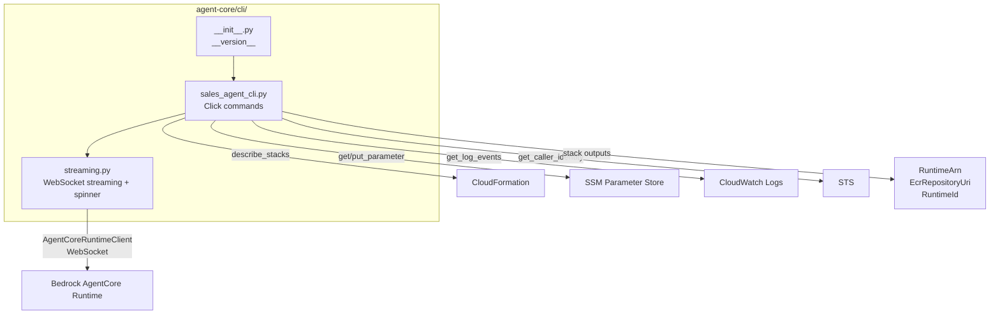

# Design Document: sales-agent-cli

## Overview

This design replaces the existing `agent-core/chat_cli.py` (a simple HTTP POST REPL) with a full-featured Click-based CLI package at `agent-core/cli/`. The new CLI communicates with the deployed AgentCore Sales Agent via the Bedrock AgentCore SDK (WebSocket streaming) instead of HTTP, and adds operational commands for parameter management, log retrieval, deployment status, and interactive chat sessions.

The CLI resolves infrastructure references (Runtime ARN, log group, SSM prefix) from CloudFormation stack outputs using a `--stack-name` global option, with `AGENTCORE_STACK_NAME` env var fallback. Global `-v`/`-vv` verbosity flags control output detail across all subcommands.

### Key Design Decisions

1. **Click over argparse**: Click provides built-in support for command groups, option inheritance via context, and rich help formatting — all needed for the multi-command structure.
2. **Stack-name-centric resolution**: All resource references (Runtime ARN, log group, SSM prefix) derive from CloudFormation stack outputs, avoiding hardcoded ARNs or separate config files.
3. **Streaming module separation**: The `streaming.py` module encapsulates all WebSocket response handling, thinking spinner logic, and performance metrics — keeping the command modules focused on CLI concerns.
4. **AgentCoreRuntimeClient for invocation**: Uses the official `bedrock_agentcore.runtime.AgentCoreRuntimeClient` to generate presigned WebSocket URLs, matching the pattern in the existing `test_invoke.py`.

## Architecture



### Command Structure

```
sales-agent-cli [--stack-name NAME] [-v|-vv]
├── invoke   --message MSG [--session-id ID] [--actor-id ID]
├── chat
├── param
│   ├── set  --key KEY --value VALUE
│   ├── get  --key KEY
│   └── list
├── logs     [--tail N] [--start TIME] [--end TIME]
├── status
└── version
```

### Data Flow

1. User runs a command with `--stack-name` (or `AGENTCORE_STACK_NAME` env var)
2. CLI validates AWS credentials via STS `GetCallerIdentity`
3. CLI calls `describe_stacks` to validate the stack and cache outputs
4. Subcommand executes using cached stack outputs (RuntimeArn, RuntimeId, etc.)
5. For `invoke`/`chat`: `AgentCoreRuntimeClient.generate_presigned_url()` → WebSocket connection → streaming response via `streaming.py`

## Components and Interfaces

### 1. `cli/__init__.py`

Defines `__version__` string. Makes the package importable.

```python
__version__ = "0.1.0"
```

### 2. `cli/sales_agent_cli.py` — Main CLI Module


#### `SalesAgentCLI` Class

Central class that manages stack validation, resource resolution, and boto3 client creation.

```python
class SalesAgentCLI:
    """Manages stack context and AWS client interactions for all CLI commands."""

    def __init__(self, stack_name: str, verbosity: int = 0):
        self.stack_name = stack_name
        self.verbosity = verbosity
        self.stack_outputs: dict[str, str] = {}
        self.session: boto3.Session = boto3.Session()

    def validate_credentials(self) -> dict:
        """Call STS GetCallerIdentity. Raises ClickException on failure."""

    def validate_stack(self) -> dict[str, str]:
        """Call describe_stacks, cache outputs. Raises ClickException if not found."""

    def get_runtime_arn(self) -> str:
        """Return RuntimeArn from stack outputs, or attempt SDK fallback."""

    def get_ssm_prefix(self) -> str:
        """Derive SSM prefix from stack outputs or default to /agentcore/sales-agent/."""

    def get_log_group(self) -> str:
        """Derive log group from RuntimeId: /aws/bedrock-agentcore/runtimes/{id}-DEFAULT."""

    def create_client(self, service: str) -> boto3.client:
        """Create a boto3 client for the given service."""
```

#### Click Command Group

```python
@click.group()
@click.option("--stack-name", envvar="AGENTCORE_STACK_NAME", required=False)
@click.option("-v", "--verbose", count=True, help="Increase verbosity (-v verbose, -vv debug)")
@click.pass_context
def cli(ctx, stack_name, verbose):
    """Sales Agent CLI — interact with your deployed AgentCore agent."""
    ctx.ensure_object(dict)
    ctx.obj["verbosity"] = verbose
    # stack_name validation deferred to subcommands that need it
    ctx.obj["stack_name"] = stack_name
```

Commands that require a stack (`invoke`, `chat`, `param`, `logs`, `status`) will validate the stack name is present and call `validate_stack()` in a shared decorator or at command entry.

#### Command Implementations

- **`invoke`**: Resolves Runtime ARN → creates `AgentCoreRuntimeClient` → generates presigned URL → opens WebSocket → sends message → delegates to `StreamingResponseHandler` → prints response and metrics.
- **`chat`**: Generates session ID (UUID4) → enters REPL loop → dispatches slash commands (`/exit`, `/clear`, `/session`, `/help`) → sends messages via same invoke path → logs interactions to `~/.sales-agent-cli/logs/{session_id}.jsonl`.
- **`param set/get/list`**: Derives SSM prefix → calls `put_parameter`/`get_parameter`/`get_parameters_by_path`.
- **`logs`**: Derives log group → calls `filter_log_events` with time filters → color-codes by severity → formats JSON bodies.
- **`status`**: Calls `describe_stacks` → displays stack info → calls `describe_services` for ECS health → shows recent events if stack is transitional.
- **`version`**: Prints `cli.__version__`.

### 3. `cli/streaming.py` — Streaming Response Handler

```python
@dataclass
class PerformanceMetrics:
    """Tracks timing data for a single agent invocation."""
    time_to_first_token: float | None = None
    total_duration: float | None = None

class StreamingResponseHandler:
    """Processes streamed WebSocket responses with thinking spinner and metrics."""

    def __init__(self, verbosity: int = 0):
        self.verbosity = verbosity
        self.metrics = PerformanceMetrics()

    async def handle_stream(self, websocket) -> tuple[str, PerformanceMetrics]:
        """
        Process the WebSocket stream:
        1. Start thinking spinner
        2. On <thinking> content: show alongside spinner
        3. On first non-thinking chunk: stop spinner, start printing
        4. Record TTFB and total duration
        5. Return (full_response_text, metrics)
        """

    def _start_spinner(self) -> None:
        """Start the animated thinking spinner."""

    def _update_spinner(self, thinking_text: str) -> None:
        """Update spinner with <thinking> tag content."""

    def _stop_spinner(self) -> None:
        """Stop spinner (not clear) when first response chunk arrives."""
```

The spinner uses `click.echo` with `\r` carriage return for in-place updates. When stopped, the spinner line remains visible (not cleared), and response text begins on a new line.

#### Thinking Tag Parsing

The handler watches for `<thinking>` and `</thinking>` tags in the stream. Content between these tags is displayed as a status message alongside the spinner animation. This is parsed incrementally as chunks arrive — the handler maintains a simple state machine:

```
WAITING → (first chunk with <thinking>) → THINKING → (</thinking>) → RESPONDING
WAITING → (first chunk without <thinking>) → RESPONDING
```

## Data Models

### PerformanceMetrics

```python
@dataclass
class PerformanceMetrics:
    time_to_first_token: float | None = None  # seconds from send to first chunk
    total_duration: float | None = None        # seconds from send to stream end
```

### Stack Context (cached in Click context)

```python
# Stored in ctx.obj after validate_stack()
{
    "stack_name": "AgentCoreStack",
    "verbosity": 1,
    "cli": SalesAgentCLI,  # instance
    "outputs": {
        "RuntimeArn": "arn:aws:bedrock-agentcore:...",
        "RuntimeId": "agentcore_sales_agent-XXXXX",
        "EcrRepositoryUri": "718498700052.dkr.ecr.us-east-1.amazonaws.com/...",
    }
}
```

### Chat Log Entry (JSONL format)

```json
{
    "timestamp": "2025-01-15T10:30:00Z",
    "session_id": "a1b2c3d4-...",
    "role": "user|assistant",
    "content": "message text",
    "metrics": {
        "time_to_first_token": 1.23,
        "total_duration": 4.56
    }
}
```

### Log Severity Color Map

| Severity | Color   |
|----------|---------|
| ERROR    | Red     |
| WARN     | Yellow  |
| INFO     | Default |
| DEBUG    | Dim     |


## Correctness Properties

*A property is a characteristic or behavior that should hold true across all valid executions of a system — essentially, a formal statement about what the system should do. Properties serve as the bridge between human-readable specifications and machine-verifiable correctness guarantees.*

### Property 1: Stack name environment variable fallback

*For any* non-empty string used as a stack name, if the `AGENTCORE_STACK_NAME` environment variable is set to that string and `--stack-name` is not provided on the command line, the CLI's resolved stack name should equal the environment variable value.

**Validates: Requirements 1.3**

### Property 2: Verbosity flag count

*For any* invocation of the CLI with N `-v` flags (where N is 0, 1, or 2), the resolved verbosity level stored in the Click context should equal N.

**Validates: Requirements 1.7**

### Property 3: Stack output extraction

*For any* CloudFormation `describe_stacks` response containing a list of output key-value pairs, after `validate_stack()` completes, the cached `stack_outputs` dict should contain every output key mapped to its corresponding value from the response.

**Validates: Requirements 2.3**

### Property 4: SSM prefix derivation

*For any* stack name string, the derived SSM parameter prefix should follow the pattern `/{normalized_stack_name}/` or match the prefix from stack outputs if available, and should always start and end with `/`.

**Validates: Requirements 3.2**

### Property 5: Parameter set/get round trip

*For any* key string and value string, calling `param set --key <key> --value <value>` followed by `param get --key <key>` should return the exact same value string.

**Validates: Requirements 3.3, 3.4**

### Property 6: Parameter list completeness

*For any* set of parameters stored under the SSM prefix, calling `param list` should return a result set that contains every parameter name and value in the stored set, with no omissions.

**Validates: Requirements 3.6**

### Property 7: Session ID in invocation payload

*For any* session ID string provided via `--session-id`, the payload sent to the AgentCore runtime should contain a field with that exact session ID value.

**Validates: Requirements 4.7**

### Property 8: Chat session ID uniqueness

*For any* two chat sessions started by the CLI, their generated session IDs should be distinct. Within a single session, all messages should carry the same session ID.

**Validates: Requirements 5.2**

### Property 9: Performance metrics TTFB recording

*For any* stream of response chunks with known timestamps, the `time_to_first_token` metric should equal the time delta between the invocation start and the arrival of the first chunk, and `total_duration` should equal the time delta between invocation start and stream completion.

**Validates: Requirements 5.9, 6.5**

### Property 10: Chat interaction logging round trip

*For any* chat message sent and response received, reading the log file at `~/.sales-agent-cli/logs/` should yield a record containing the original message content, the response content, and a valid timestamp.

**Validates: Requirements 5.10**

### Property 11: Thinking tag content extraction

*For any* string containing `<thinking>...</thinking>` tags, the streaming handler should extract the text between the tags and make it available as the thinking status text. For strings without thinking tags, no thinking content should be extracted.

**Validates: Requirements 6.3**

### Property 12: Stream completion returns concatenated response with metrics

*For any* sequence of non-thinking response chunks, the complete response text returned by the streaming handler should equal the concatenation of all chunk texts in order, and the returned `PerformanceMetrics` should have non-None `total_duration`.

**Validates: Requirements 4.6, 6.6**

### Property 13: Partial response on stream error

*For any* stream that delivers N chunks before raising an error, the returned response text should contain the concatenation of those N chunks, and the error message should be surfaced to the user.

**Validates: Requirements 6.7**

### Property 14: Log tail returns requested count

*For any* positive integer N and any set of log events of size M, `logs --tail N` should display exactly `min(N, M)` log lines.

**Validates: Requirements 7.2**

### Property 15: Time expression parsing

*For any* valid ISO 8601 timestamp string or relative time expression (e.g. "1h ago", "30m ago"), the time parser should produce a Unix timestamp that correctly represents the specified point in time. Parsing then formatting back should preserve the same point in time (within 1-second tolerance).

**Validates: Requirements 7.3, 7.4**

### Property 16: Log severity color mapping

*For any* log severity level string, the color-coding function should return a deterministic, correct color value — ERROR maps to red, WARN to yellow, INFO to default, DEBUG to dim — and unknown severity levels should map to default.

**Validates: Requirements 7.5**

### Property 17: JSON log formatting

*For any* valid JSON string embedded in a log message, the log formatter should produce output that is valid pretty-printed JSON. Parsing the formatted output should yield an object equal to the original.

**Validates: Requirements 7.6**

### Property 18: Status displays all stack outputs

*For any* CloudFormation stack with a set of outputs, the `status` command output should contain every output key and value from the stack.

**Validates: Requirements 8.2**

### Property 19: Transitional state detection

*For any* CloudFormation stack status string, the CLI should classify it as transitional if and only if it ends with `_IN_PROGRESS`, and should fetch recent events only for transitional states.

**Validates: Requirements 8.4**

## Error Handling

### AWS Credential Errors
- STS `GetCallerIdentity` failure → exit with error message including the STS exception details (e.g. `ExpiredTokenException`)
- All boto3 `ClientError` exceptions are caught at the command level and displayed with context

### Stack Validation Errors
- `describe_stacks` raises `ClientError` with "does not exist" → exit with "Stack '{name}' not found"
- Missing `RuntimeArn` output → attempt SDK fallback via `list_agent_runtimes`, then exit if still unresolved

### Parameter Store Errors
- `ParameterNotFound` on `get_parameter` → "Parameter '{key}' not found under prefix '{prefix}'"
- `AccessDeniedException` → "Insufficient permissions to access Parameter Store"

### Streaming Errors
- WebSocket connection failure → "Failed to connect to runtime: {error}"
- Stream interrupted mid-response → return partial response text + display error
- Timeout waiting for first chunk → "Agent did not respond within {timeout}s"

### CloudWatch Logs Errors
- Log group not found → "Log group not found. Is the runtime deployed?"
- `AccessDeniedException` → "Insufficient permissions to read CloudWatch logs"

### General Pattern
All commands use `click.ClickException` for user-facing errors (Click handles formatting and exit code). Debug-level details (full tracebacks, raw responses) are shown only at `-vv` verbosity.

## Testing Strategy

### Testing Framework

- **Unit/example tests**: `pytest` (already in dev dependencies)
- **Property-based tests**: `hypothesis` (already in dev dependencies)
- **Mocking**: `pytest-mock` + `moto` for AWS service mocking

### Unit Tests

Unit tests cover specific examples, edge cases, and integration points:

- CLI entry point invocation and help output
- Stack name resolution with/without env var, with/without CLI arg
- STS credential validation (mocked success and failure)
- Stack validation with mocked CloudFormation responses
- Parameter set/get/list with mocked SSM
- Slash command dispatch (`/exit`, `/quit`, `/q`, `/clear`, `/session`, `/help`)
- Version command output matches `__version__`
- Log severity color mapping for known and unknown levels
- Error conditions: missing stack, missing parameter, no Runtime ARN, stream errors

### Property-Based Tests

Each correctness property maps to a single `hypothesis` property test. Configuration:

- Minimum 100 examples per test (`@settings(max_examples=100)`)
- Each test tagged with a comment: `# Feature: sales-agent-cli, Property {N}: {title}`
- Generators use `hypothesis.strategies` for strings, integers, dicts, and composite strategies for domain objects

Key property test implementations:

1. **Stack name env var fallback** — generate random stack name strings, set env var, verify resolution
2. **Verbosity flag count** — generate 0/1/2, invoke CLI, verify context
3. **Stack output extraction** — generate random output dicts, mock describe_stacks, verify cache
4. **SSM prefix derivation** — generate random stack names, verify prefix format
5. **Param set/get round trip** — generate random key/value pairs, mock SSM, verify round trip
6. **Param list completeness** — generate random parameter sets, mock SSM, verify all returned
7. **Session ID in payload** — generate random session IDs, verify payload construction
8. **Session ID uniqueness** — generate multiple sessions, verify distinct IDs
9. **TTFB recording** — generate random timestamps, verify metric calculation
10. **Chat logging round trip** — generate random messages, verify log file contents
11. **Thinking tag extraction** — generate random strings with/without thinking tags, verify extraction
12. **Stream completion** — generate random chunk sequences, verify concatenation and metrics
13. **Partial response on error** — generate partial chunk sequences, verify partial text returned
14. **Log tail count** — generate random N and event counts, verify min(N, M) lines
15. **Time expression parsing** — generate random ISO timestamps and relative expressions, verify parsing
16. **Severity color mapping** — generate severity strings, verify deterministic color output
17. **JSON log formatting** — generate random JSON objects, verify pretty-print round trip
18. **Status displays outputs** — generate random output sets, verify all present in output
19. **Transitional state detection** — generate random status strings, verify _IN_PROGRESS classification

### Test Organization

```
agent-core/tests/
├── __init__.py
├── cli/
│   ├── __init__.py
│   ├── test_sales_agent_cli.py    # Unit + property tests for CLI commands
│   ├── test_streaming.py          # Unit + property tests for streaming handler
│   └── test_time_parser.py        # Property tests for time expression parsing
```

