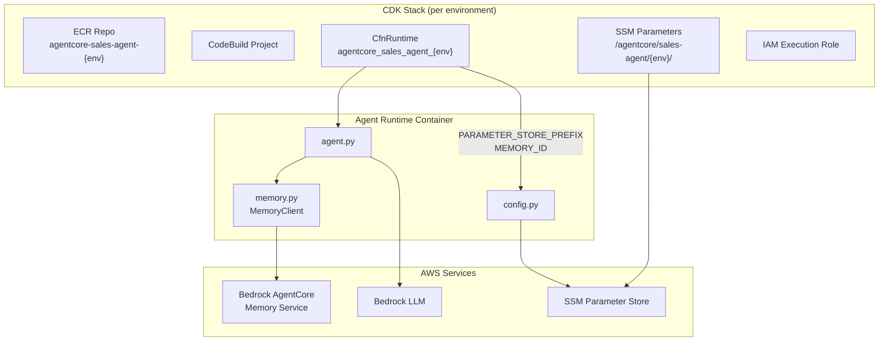
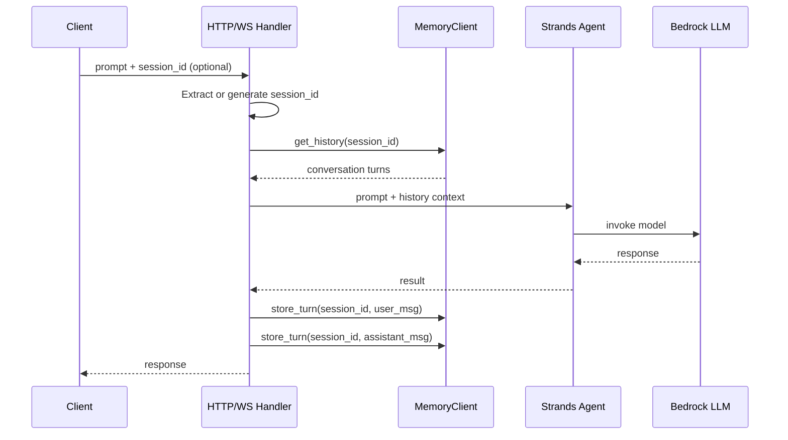

# Design Document: Staging and Memory

## Overview

This design covers two complementary capabilities for the AgentCore Sales Agent:

1. **Staging Deployment** — Parameterize the CDK stack, deploy script, and CDK app entry point so that multiple isolated environments (e.g., `staging`, `production`) can coexist in the same AWS account with no resource collisions.

2. **Short-Term Memory** — Integrate Bedrock AgentCore's built-in memory service so the agent retains conversation context within a session. Both the HTTP entrypoint and WebSocket handler will retrieve prior turns before generating a response and persist each exchange afterward.

The existing CLI already supports `--stack-name` for targeting different stacks, so no CLI changes are needed. The existing `config.py` already reads `PARAMETER_STORE_PREFIX` from the environment variable set by CfnRuntime, so it requires no changes either — each environment's CfnRuntime will set a different prefix automatically.

## Architecture



### Request Flow (with Memory)



## Components and Interfaces

### 1. CDK Stack Changes (`agentcore_stack.py`)

The stack reads a new `env-name` context parameter (default: `"production"`) and uses it to namespace all resources:

| Resource | Current Name | Parameterized Name |
|---|---|---|
| CfnRuntime name | `agentcore_sales_agent` | `agentcore_sales_agent_{env}` |
| ECR repository | (auto-generated) | logical ID includes `{env}` |
| SSM prefix | `/agentcore/sales-agent/` | `/agentcore/sales-agent/{env}/` |
| PARAMETER_STORE_PREFIX env var | `/agentcore/sales-agent/` | `/agentcore/sales-agent/{env}/` |
| MEMORY_ID env var | (none) | Set from `memory-id` CDK context, empty string if not provided |

The stack also adds a `MEMORY_ID` environment variable to the CfnRuntime, sourced from an optional `memory-id` CDK context parameter.

The IAM execution role gains `bedrock-agentcore:memory:*` permissions for the memory service API calls.

### 2. CDK App Entry Point (`app.py`)

The app reads `env-name` from CDK context and passes it to the stack constructor. The stack ID becomes `AgentCoreStack-{env}` so that CDK treats each environment as a separate CloudFormation stack.

```python
env_name = app.node.try_get_context("env-name") or "production"
AgentCoreStack(app, f"AgentCoreStack-{env_name}", env_name=env_name)
```

### 3. Deploy Script Changes (`deploy.sh`)

New `--env` flag (default: `production`):
- Passes `--context env-name={env}` to CDK
- Sets stack name to `AgentCoreStack-{env}`
- Writes outputs to `cdk-outputs-{env}.json`
- Extracts outputs using the environment-specific stack key

Optional `--memory-id` flag:
- Passes `--context memory-id={id}` to CDK

### 4. MemoryClient (`memory.py`)

A new module providing a thin wrapper around the `bedrock-agentcore` SDK's memory APIs:

```python
class MemoryClient:
    def __init__(self, memory_id: str):
        """Initialize with memory resource ID from config."""

    def get_history(self, session_id: str, actor_id: str = "user", last_k: int = 10) -> list[dict]:
        """Retrieve last K turns for a session. Returns empty list on error."""

    def store_turn(self, session_id: str, actor_id: str, role: str, content: str) -> None:
        """Store a single conversation turn. Logs warning on error."""
```

Key design decisions:
- **Graceful degradation**: All memory operations catch exceptions, log warnings, and continue. The agent always works even if memory is unavailable.
- **Session management**: Uses `MemorySessionManager` from `bedrock-agentcore` SDK. Sessions are created on-demand when a new `session_id` is encountered.
- **Actor ID**: Defaults to `"user"` but can be overridden from the payload.

### 5. Agent Handler Changes (`agent.py`)

Both `invoke` (HTTP) and `ws_handler` (WebSocket) are updated to:

1. Extract `session_id` from payload (or generate a UUID if absent)
2. Call `memory_client.get_history(session_id)` to retrieve prior turns
3. Build a history string and prepend it to the prompt
4. After getting the agent response, call `memory_client.store_turn()` for both the user message and assistant response
5. If `memory_client` is `None` (no MEMORY_ID configured), skip all memory operations

The `MemoryClient` is initialized at module level alongside `Config`, only if `MEMORY_ID` is set in the environment.

### 6. Config (`config.py`) — No Changes

The existing config module already reads `PARAMETER_STORE_PREFIX` from the environment variable. Since each environment's CfnRuntime sets a different prefix, config resolution is automatically environment-aware. The `MEMORY_ID` environment variable is read directly in `agent.py` (or `memory.py`) since it's a simple string, not a Parameter Store path.

## Data Models

### Memory Turn Structure

Each turn stored in the memory service:

```python
{
    "session_id": str,      # Conversation session identifier
    "actor_id": str,        # "user" or "assistant"
    "role": str,            # "user" or "assistant"
    "content": str,         # Message text
}
```

### Payload Schema (HTTP and WebSocket)

Extended payload with optional `session_id`:

```python
{
    "prompt": str,              # Required — user message
    "session_id": str | None,   # Optional — conversation session ID
}
```

When `session_id` is absent, the handler generates a new UUID v4.

### CDK Context Parameters

| Parameter | Type | Default | Description |
|---|---|---|---|
| `env-name` | string | `"production"` | Environment name for resource namespacing |
| `memory-id` | string | `""` | Bedrock AgentCore memory resource ID |
| (existing params) | — | — | `aoss-endpoint`, `item-table-name`, etc. |

### Deploy Script Flags

| Flag | Default | Description |
|---|---|---|
| `--env` | `production` | Target environment name |
| `--memory-id` | (none) | Memory resource ID to pass to CDK |


## Correctness Properties

*A property is a characteristic or behavior that should hold true across all valid executions of a system — essentially, a formal statement about what the system should do. Properties serve as the bridge between human-readable specifications and machine-verifiable correctness guarantees.*

### Property 1: Environment name embedded in all resource identifiers

*For any* valid environment name string, synthesizing the CDK stack with that env name should produce a CfnRuntime name containing the env name, an SSM parameter prefix containing the env name, and an ECR-related logical ID containing the env name. Consequently, for any two distinct environment names, all generated resource identifiers must differ.

**Validates: Requirements 1.1, 1.3, 1.4, 1.5**

### Property 2: Config prefix sourced from environment variable

*For any* valid prefix string set as the `PARAMETER_STORE_PREFIX` environment variable, `Config.load()` should use that exact prefix when fetching parameters from Parameter Store.

**Validates: Requirements 3.1, 3.2**

### Property 3: Config resolution order (Parameter Store → env var → default)

*For any* configuration field, if a value is present in Parameter Store under the active prefix, that value must be used regardless of environment variable or default values. If absent from Parameter Store but present as an environment variable, the environment variable must be used. If absent from both, the default must be used.

**Validates: Requirements 3.3**

### Property 4: Provided session ID used for memory operations

*For any* prompt payload (HTTP or WebSocket) that includes a `session_id` field, the handler must use that exact session ID when calling `get_history` and `store_turn` on the memory client.

**Validates: Requirements 4.1, 5.1, 6.1**

### Property 5: Missing session ID generates a new valid UUID

*For any* prompt payload (HTTP or WebSocket) that does not include a `session_id` field, the handler must generate a new UUID v4 string and use it for all memory operations in that exchange.

**Validates: Requirements 4.3, 5.2, 6.2**

### Property 6: Conversation history included in prompt context

*For any* non-empty conversation history retrieved from the memory service, the prompt sent to the Strands Agent must contain the content of those prior turns.

**Validates: Requirements 4.4**

### Property 7: Both user and assistant turns stored after exchange

*For any* successful prompt/response exchange (HTTP or WebSocket), the handler must call `store_turn` exactly twice — once with role `"user"` and the original prompt content, and once with role `"assistant"` and the response content.

**Validates: Requirements 4.2, 5.3, 6.3**

### Property 8: Graceful degradation on memory service failure

*For any* prompt, if the memory service raises an exception during `get_history` or `store_turn`, the agent must still produce a valid response (not raise an exception to the caller) and must log a warning.

**Validates: Requirements 4.5**

## Error Handling

| Scenario | Behavior |
|---|---|
| Memory service unreachable on `get_history` | Log warning, proceed with empty history. Agent responds normally. |
| Memory service unreachable on `store_turn` | Log warning, response already sent to client. Turn is lost but user experience is unaffected. |
| Invalid `session_id` format in payload | Accept any string as session_id. The memory service manages session lifecycle. |
| Missing `MEMORY_ID` env var | `MemoryClient` is not initialized (`None`). All memory operations are skipped. Agent works in stateless mode. |
| CDK `env-name` context contains invalid characters | CDK synthesis will fail with a clear error from CloudFormation naming validation. No special handling needed. |
| Deploy script `--env` not provided | Defaults to `production`. Existing behavior preserved. |

## Testing Strategy

### Property-Based Testing

Use `hypothesis` (Python) as the property-based testing library. Each property test runs a minimum of 100 iterations.

Property tests target the core logic that can be tested in isolation:

| Property | Test Approach |
|---|---|
| P1: Env name in resource IDs | Generate random alphanumeric env names, synthesize CDK template (or call the naming functions directly), verify env name appears in runtime name, SSM prefix, and ECR logical ID |
| P2: Config prefix from env var | Generate random prefix strings, mock SSM client, set env var, call `Config.load()`, verify prefix used |
| P3: Config resolution order | Generate random values for PS, env var, and default tiers; mock SSM; verify correct value wins per precedence |
| P4: Provided session_id used | Generate random session_id strings and prompts, mock memory client, invoke handler, verify session_id passed to memory calls |
| P5: Missing session_id → UUID | Generate random prompts without session_id, invoke handler, verify generated ID is valid UUID v4 |
| P6: History in prompt | Generate random history turn lists, mock memory client to return them, verify agent receives prompt containing history |
| P7: Both turns stored | Generate random prompt/response pairs, mock agent and memory, verify exactly two `store_turn` calls with correct roles |
| P8: Graceful degradation | Generate random prompts, mock memory client to raise exceptions, verify agent still returns a response |

Each test must be tagged with a comment:
```python
# Feature: staging-and-memory, Property 1: Environment name embedded in all resource identifiers
```

### Unit Testing

Unit tests complement property tests for specific examples and edge cases:

- **CDK stack defaults**: Verify that omitting `env-name` context produces `production` resource names (Req 1.2)
- **Deploy script defaults**: Verify `--env` defaults to `production` (Req 2.2)
- **Deploy script output file naming**: Verify output file is `cdk-outputs-{env}.json` (Req 2.4)
- **Deploy script stack name**: Verify stack name is `AgentCoreStack-{env}` (Req 2.3)
- **Deploy script context passing**: Verify `--env staging` passes `--context env-name=staging` (Req 2.1)
- **Memory client initialization**: Verify `MemoryClient` is `None` when `MEMORY_ID` is empty
- **Empty history**: Verify handler works correctly when `get_history` returns empty list

### Test Organization

```
tests/
  test_cdk_env_parameterization.py    # P1 property + unit tests for CDK naming
  test_config_resolution.py           # P2, P3 property + unit tests for config
  test_memory_client.py               # Unit tests for MemoryClient wrapper
  test_handler_memory.py              # P4-P8 property + unit tests for handler memory integration
  test_deploy_script.py               # Unit tests for deploy script behavior
```
