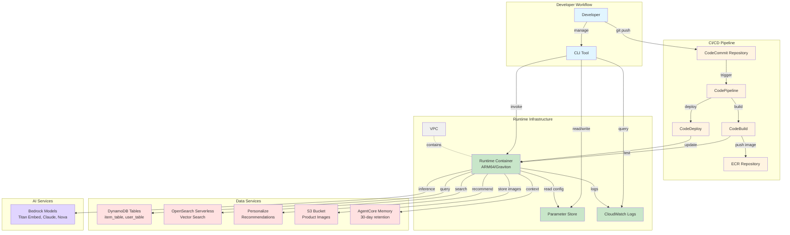
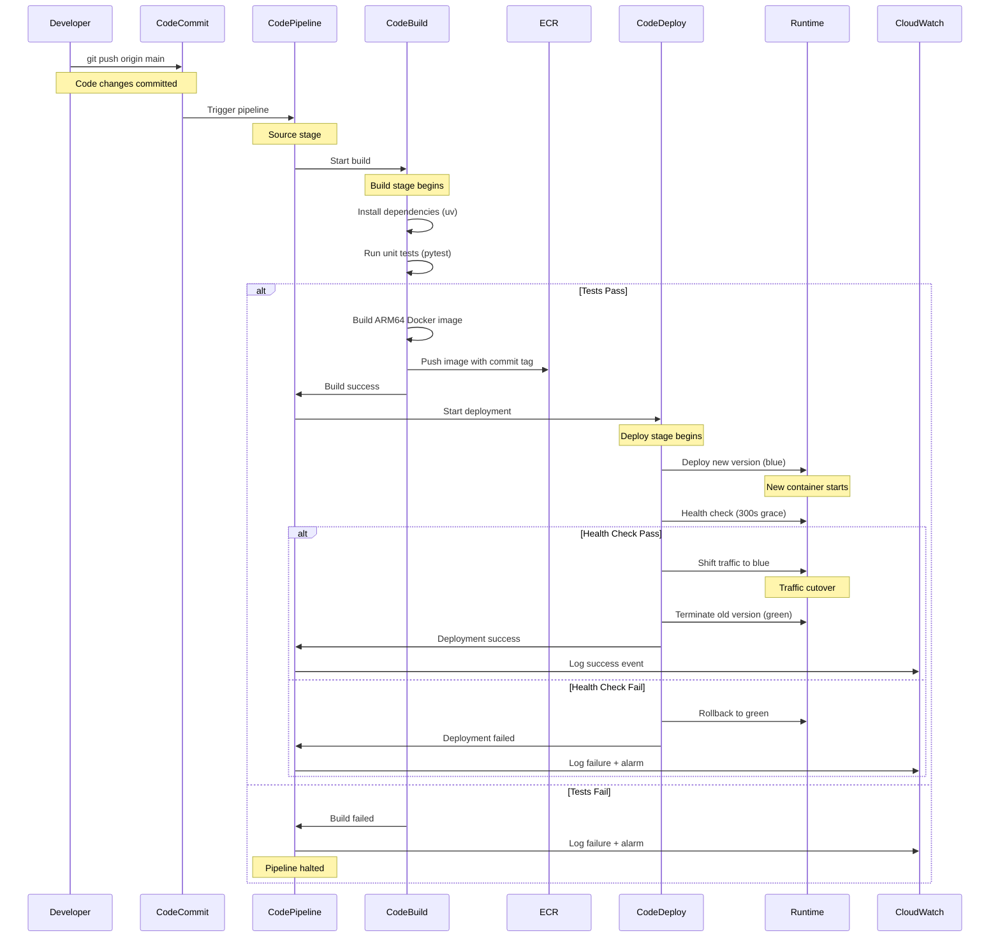
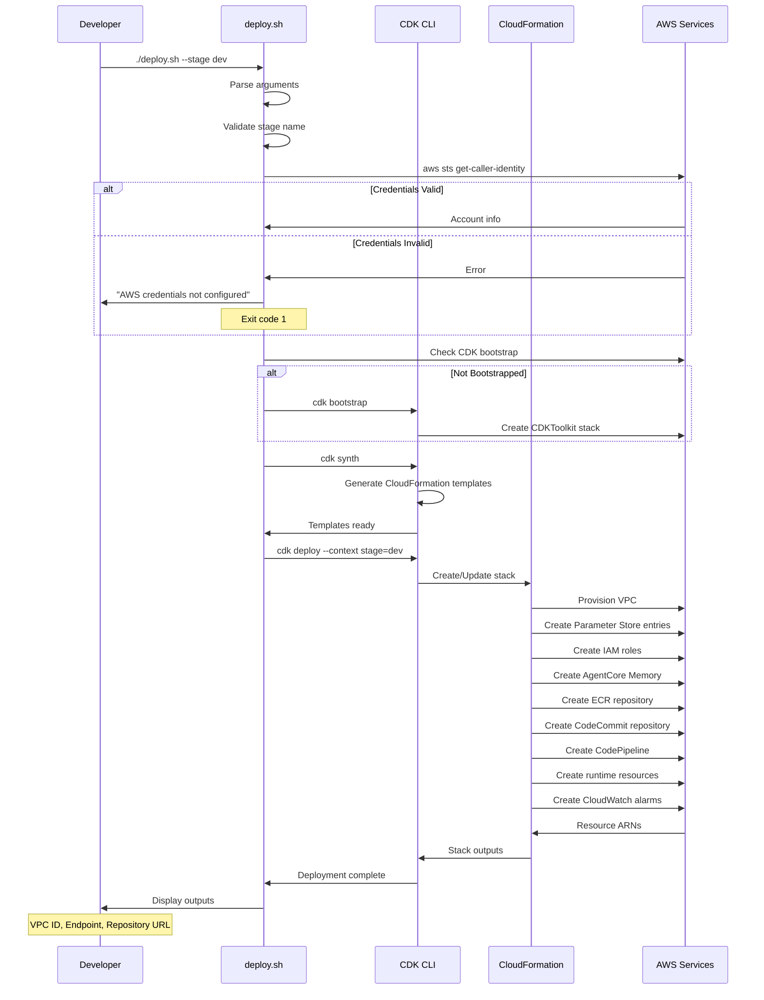
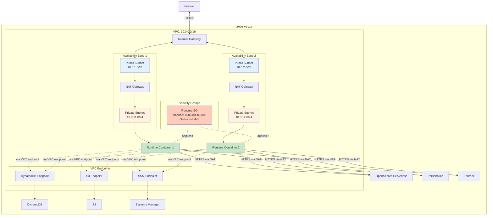
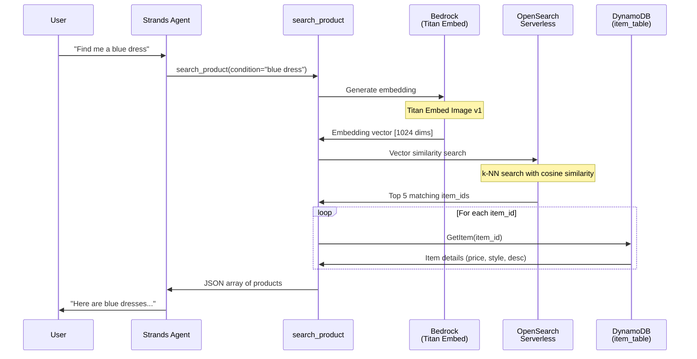
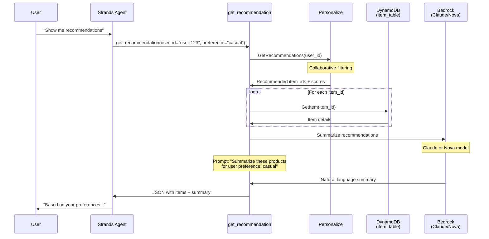
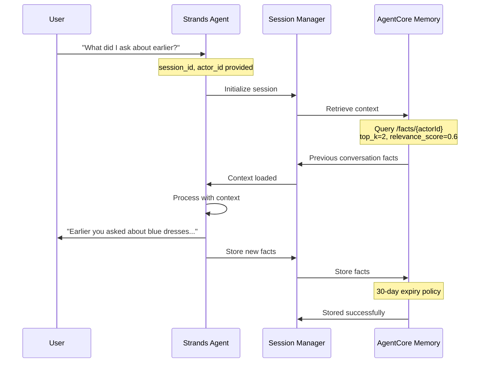
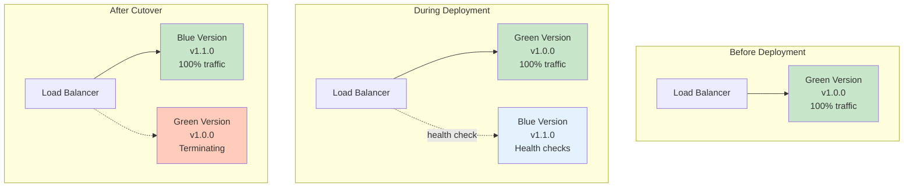
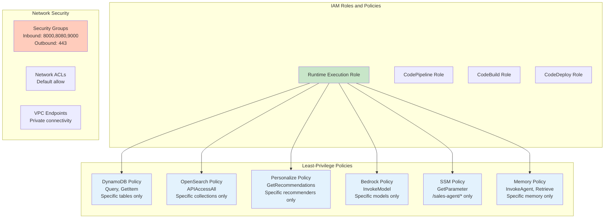

# Architecture Diagrams

This document provides detailed architecture diagrams for the AgentCore CDK Infrastructure project.

## Table of Contents

- [High-Level Architecture](#high-level-architecture)
- [CI/CD Pipeline Flow](#cicd-pipeline-flow)
- [Deployment Flow](#deployment-flow)
- [Network Architecture](#network-architecture)
- [Runtime Component Architecture](#runtime-component-architecture)
- [Data Flow](#data-flow)

## High-Level Architecture



### Component Descriptions

**Developer Workflow Layer**:
- **Developer**: Writes code, pushes to repository, manages infrastructure
- **CLI Tool**: Command-line interface for parameter management, invocations, and operations

**CI/CD Pipeline Layer**:
- **CodeCommit**: Git repository for source code version control
- **CodePipeline**: Orchestrates automated build and deployment workflow
- **CodeBuild**: Builds ARM64 Docker images, runs tests
- **CodeDeploy**: Performs blue/green deployments with health checks
- **ECR**: Stores container images with versioning

**Runtime Infrastructure Layer**:
- **VPC**: Network isolation with public/private subnets
- **Runtime Container**: Strands SDK agent with native tools (ARM64/Graviton)
- **Parameter Store**: Centralized configuration management
- **CloudWatch Logs**: Structured logging with 30-day retention

**Data Services Layer**:
- **DynamoDB**: Product catalog and user profile storage
- **OpenSearch Serverless**: Vector similarity search for products
- **Personalize**: Collaborative filtering recommendations
- **S3**: Product image storage
- **AgentCore Memory**: Conversation context with 30-day expiry

**AI Services Layer**:
- **Bedrock Models**: Titan Embed (embeddings), Claude/Nova (inference)

## CI/CD Pipeline Flow



### Pipeline Stages

**1. Source Stage**:
- Monitors CodeCommit repository main branch
- Triggers on commit
- Outputs source artifact to S3

**2. Build Stage**:
- Installs dependencies using uv
- Runs unit tests with pytest
- Builds ARM64 Docker image
- Pushes image to ECR with commit hash tag
- Generates imagedefinitions.json artifact

**3. Deploy Stage**:
- Creates new container version (blue)
- Runs health checks (300s grace period)
- Shifts traffic atomically
- Terminates old version (green)
- Rolls back on failure

## Deployment Flow



### Deployment Steps

1. **Argument Parsing**: Parse --stage, --vpc-id, --destroy flags
2. **Credential Validation**: Verify AWS credentials are configured
3. **Bootstrap Check**: Ensure CDK is bootstrapped in account/region
4. **Synthesis**: Generate CloudFormation templates
5. **Deployment**: Create/update stack resources
6. **Output Display**: Show stack outputs for reference

## Network Architecture



### Network Configuration

**VPC CIDR**: 10.0.0.0/16

**Subnets**:
- Public Subnet AZ1: 10.0.1.0/24
- Public Subnet AZ2: 10.0.2.0/24
- Private Subnet AZ1: 10.0.11.0/24
- Private Subnet AZ2: 10.0.12.0/24

**Routing**:
- Public subnets route to Internet Gateway
- Private subnets route to NAT Gateway
- VPC endpoints for DynamoDB, S3, SSM (no NAT charges)

**Security Groups**:
- Runtime SG: Inbound 8000, 8080, 9000 from VPC CIDR
- Runtime SG: Outbound 443 to all (for AWS services)

## Runtime Component Architecture

```mermaid
graph TB
    subgraph "Runtime Container"
        subgraph "Initialization Layer"
            INIT[Module-Level Initialization]
            CLIENTS[AWS Service Clients]
            CONFIG[Configuration Loader]
        end
        
        subgraph "Application Layer"
            ENTRY[agent_invocation<br/>@app.entrypoint]
            AGENT[Strands Agent]
            SESSION[Session Manager]
        end
        
        subgraph "Tools Layer"
            SEARCH[search_product<br/>@tool]
            RECOMMEND[get_recommendation<br/>@tool]
        end
        
        subgraph "Service Integration Layer"
            BEDROCK[Bedrock Client<br/>Embeddings + Inference]
            DYNAMO[DynamoDB Client<br/>Query + GetItem]
            OPENSEARCH[OpenSearch Client<br/>Vector Search]
            PERSONALIZE[Personalize Client<br/>GetRecommendations]
        end
    end
    
    subgraph "External Services"
        PS[Parameter Store]
        DDB[DynamoDB Tables]
        AOSS[OpenSearch Serverless]
        PER[Personalize]
        BR[Bedrock Models]
        MEM[AgentCore Memory]
    end
    
    INIT --> CLIENTS
    INIT --> CONFIG
    CONFIG --> PS
    
    CLIENTS --> BEDROCK
    CLIENTS --> DYNAMO
    CLIENTS --> OPENSEARCH
    CLIENTS --> PERSONALIZE
    
    ENTRY --> AGENT
    AGENT --> SESSION
    SESSION --> MEM
    
    AGENT --> SEARCH
    AGENT --> RECOMMEND
    
    SEARCH --> BEDROCK
    SEARCH --> OPENSEARCH
    SEARCH --> DDB
    
    RECOMMEND --> PERSONALIZE
    RECOMMEND --> DYNAMO
    RECOMMEND --> BEDROCK
    
    BEDROCK --> BR
    DYNAMO --> DDB
    OPENSEARCH --> AOSS
    PERSONALIZE --> PER
    
    style INIT fill:#e1f5ff
    style ENTRY fill:#c8e6c9
    style SEARCH fill:#fff4e1
    style RECOMMEND fill:#fff4e1
    style BEDROCK fill:#ffe1e1
    style DYNAMO fill:#ffe1e1
    style OPENSEARCH fill:#ffe1e1
    style PERSONALIZE fill:#ffe1e1
```

### Component Responsibilities

**Initialization Layer**:
- Module-level AWS client initialization (reused across invocations)
- Configuration loading from Parameter Store
- Environment variable processing

**Application Layer**:
- `agent_invocation`: Entrypoint decorated with @app.entrypoint
- Strands Agent: Orchestrates tool execution and LLM interaction
- Session Manager: Manages AgentCore Memory integration

**Tools Layer**:
- `search_product`: Vector similarity search for products
- `get_recommendation`: Personalized product recommendations

**Service Integration Layer**:
- Bedrock Client: Embeddings (Titan) and inference (Claude/Nova)
- DynamoDB Client: Query and GetItem operations
- OpenSearch Client: Vector search with AWSV4SignerAuth
- Personalize Client: GetRecommendations API

## Data Flow

### Search Product Flow



### Get Recommendation Flow



### Memory Integration Flow



## Deployment Patterns

### Multi-Stage Deployment

```mermaid
graph LR
    subgraph "AWS Account"
        subgraph "Dev Stage"
            VPC_DEV[VPC-dev]
            RT_DEV[Runtime-dev]
            PS_DEV[/sales-agent/dev/*]
        end
        
        subgraph "Staging Stage"
            VPC_STG[VPC-staging]
            RT_STG[Runtime-staging]
            PS_STG[/sales-agent/staging/*]
        end
        
        subgraph "Prod Stage"
            VPC_PROD[VPC-prod]
            RT_PROD[Runtime-prod]
            PS_PROD[/sales-agent/prod/*]
        end
        
        subgraph "Shared Services"
            ECR[ECR Repositories<br/>sales-agent-dev<br/>sales-agent-staging<br/>sales-agent-prod]
        end
    end
    
    RT_DEV -.-> ECR
    RT_STG -.-> ECR
    RT_PROD -.-> ECR
    
    style VPC_DEV fill:#e3f2fd
    style VPC_STG fill:#fff3e0
    style VPC_PROD fill:#ffebee
    style RT_DEV fill:#c8e6c9
    style RT_STG fill:#fff9c4
    style RT_PROD fill:#ffccbc
```

### Blue/Green Deployment



## Security Architecture



## Monitoring Architecture

```mermaid
graph TB
    subgraph "Runtime"
        RT[Runtime Container]
        OTEL[OpenTelemetry<br/>Instrumentation]
    end
    
    subgraph "CloudWatch"
        LOGS[CloudWatch Logs<br/>/aws/sales-agent/{stage}]
        METRICS[CloudWatch Metrics<br/>Custom namespace: SalesAgent]
        ALARMS[CloudWatch Alarms<br/>Error rate, Latency]
    end
    
    subgraph "Notifications"
        SNS[SNS Topic]
        EMAIL[Email Subscribers]
        SLACK[Slack Integration]
    end
    
    RT --> OTEL
    OTEL --> LOGS
    OTEL --> METRICS
    
    METRICS --> ALARMS
    ALARMS --> SNS
    SNS --> EMAIL
    SNS --> SLACK
    
    style RT fill:#c8e6c9
    style OTEL fill:#e3f2fd
    style LOGS fill:#fff4e1
    style METRICS fill:#fff4e1
    style ALARMS fill:#ffccbc
```

---

## Diagram Formats

All diagrams in this document use Mermaid syntax for easy rendering in:
- GitHub Markdown
- GitLab Markdown
- Documentation sites (MkDocs, Docusaurus, etc.)
- VS Code with Mermaid extension

To render these diagrams:
1. View in GitHub/GitLab (automatic rendering)
2. Use Mermaid Live Editor: https://mermaid.live
3. Install VS Code Mermaid extension
4. Use documentation generators with Mermaid support
